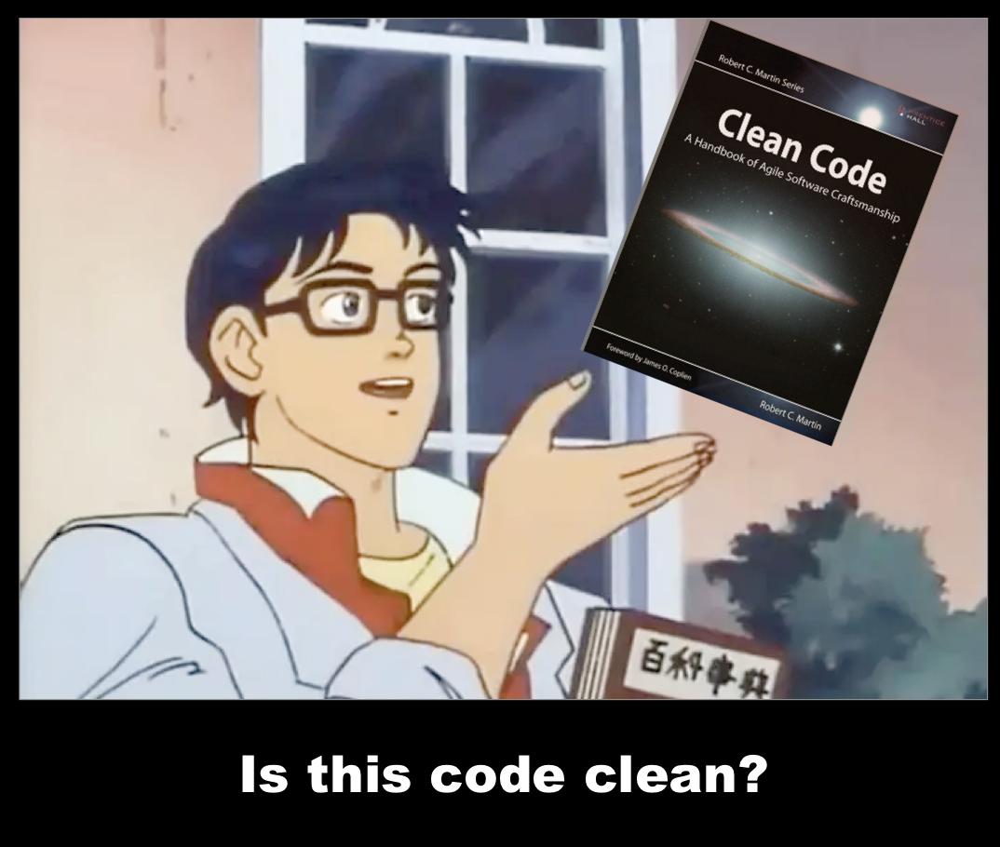
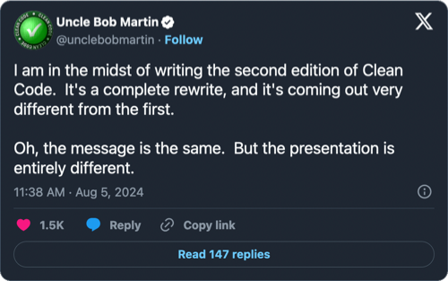

# Clean Code - Critical Analysis

Clean code is probably the most recommended book to entry level engineers and junior developers. While it might have been good recommendation in the past, I don't believe that's the case anymore.

After revisiting the book in 2023 I was surprised to notice that:

- The book is old and it hasn't aged well
- Much of the advice is questionable, but some being outright harmful
- Examples are the worst part of the book. By any objective measure, many would qualify as "bad code."
- Lazer focus on a wrong thing and attempt to sell it as the solution to everything. Code readability is important, it is not the only one aspect
- Despite being an entry-level book, it has these vibes of implied superiority, potentially giving the readers an undeserved sense of expertise

For a significantly shorter critque of the book, check out [qntm's critique](https://qntm.org/clean). 
I mostly agree with qntm assessment. But it's a bit too emotional and personal and doesn't cover the parts i find the most harmful.

### Recommended Alternatives
If you're just starting your career and seeking books to improve your coding skills, I suggest these instead:

- [A Philosophy of Software Design](https://www.amazon.com/Philosophy-Software-Design-John-Ousterhout/dp/1732102201)  
  This is not stated explicitly as a goal, but the book is full of contra-arguments and implicit critiques to the "Clean Code".  
  This might be the best book to unlearn "Clean Code" style of development.

- [The Art of Software Design: Balancing Flexibility and Coupling](https://www.amazon.com/Balancing-Coupling-Software-Design-Addison-wesley/dp/0137353480)
  A thought-provoking book that explores software complexity through the lenses of abstraction, coupling, and modularity. 
  It is as an excellent and in-depth complement to "A Philosophy of Software Design"

Also Robert Martin is working on the second edition of *Clean Code*. It will be fun to see how much of this critique will become irrelevant 😃

 
    <a target="_blank" href="https://www.reddit.com/r/programming/comments/1eo2lo5/uncle_bob_martin_i_am_in_the_midst_of_writing_the/"></img></a>

 

## Intended Audience

- **For those recommending "Clean Code"**: 
  You may have read the book over a decade ago and found it useful at the time. This might help you reconsider.
- **For those confused after reading "Clean Code"**: 
  You’re not alone. The book can be confusing, and you might find better practical advice in modern alternatives
- **For those who enjoyed "Clean Code"**:  
  ["It's great when people get excited about things, but sometimes they get a little too excited."](https://github.com/hwayne/awesome-cold-showers)  
  I hope this critique would help you to see more nuance. 

### A Note to All Readers

This page exists as a reference for anyone. Agree or disagree, contributions to the critique are welcome via [GitHub](https://github.com/bugzmanov/cleancode-critique).

  

----------
