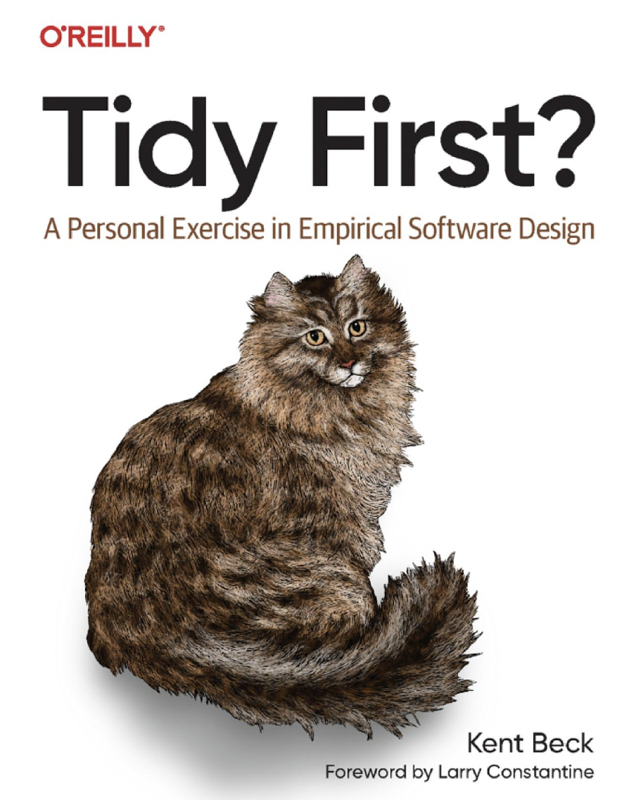

# Chapter 1: Clean Code

Here is Martin's main thesis: **bad code destroys companies**.

Ergo: Writing bad code is a mistake, and no excuse can justify it.

I know of one company that, in the late 80s, wrote a killer app. It was very popular, and lots of professionals bought and used it. But then the release cycles began to stretch. Bugs were not repaired from one release to the next. Load times grew and crashes increased. I remember the day I shut the product down in frustration and never used it again. The company went out of business a short time after that.

Two decades later I met one of the early employees of that company and asked him what had happened. The answer confirmed my fears. They had rushed the product to market and had made a huge mess in the code. As they added more and more features, the code got worse and worse until they simply could not manage it any longer.

*It was the bad code that brought the company down.*

#### A Counter-Anecdote:

> "Oracle Database 12.2.
>
> It is close to 25 million lines of C code. What an unimaginable horror! You can't change a single line of code in the product without breaking 1000s of existing tests. Generations of programmers have worked on that code under difficult deadlines and filled the code with all kinds of crap.
>
> Very complex pieces of logic, memory management, context switching, etc. are all held together with thousands of flags. The whole code is ridden with mysterious macros that one cannot decipher without picking a notebook and expanding relevant parts of the macros by hand. It can take a day to two days to really understand what a macro does.
>
> Sometimes one needs to understand the values and the effects of 20 different flags to predict how the code would behave in different situations. Sometimes 100s too! I am not exaggerating."
>
> From [HN: What's the largest amount of bad code you have ever seen work?](https://news.ycombinator.com/item?id=18442941)

As horrific as this sounds, Oracle won't go out business [anytime soon](https://www.macrotrends.net/stocks/charts/ORCL/oracle/gross-profit). I can bet my life on that.

#### A personal anecdote:
 
I worked in a small Series-A startup that had the most elegant code I've ever seen. The code was highly attuned to the domain model, well-structured and was so ergonomic that adding new features was a joy. It was the third iteration of the codebase. They run out of money. ~It was the hunt for the clean code that brought the company down~. Nah. I'm kidding. World of business is far more complex than just code quality.

Reading Clean Code in 2009, the idea that bad code being the root of all evil impressed me and I became a convert. It took me a decade to finally admit "ok. this doesn't match with reality." "Bad" code is pretty much the norm. Success or failure of an enterprise has nothing to do with it. And code that's good today will be very questionable from tomorrow's standards (this book is a perfect illustration of this).

The focus on "cleanliness" of the code often feels like bike-shedding. The real challenge is to keep the balance between complexity vs available resources to manage it. 
Oracle can afford to have complex code base as they have enough resources and (*I'm speculating*) keep throwing more bodies at the problem.

Of course you have been impeded by bad code. So then—why did you write it? <...> 

Were you trying to go fast? Were you in a rush? Probably so. Perhaps you felt that you didn't have time to do a good job

 

"Not having enough time" might be an easy excuse and rationalization. But in my experience, I'm writing bad code because:

- I don't know that it is bad
- I don't know how to make it good within the constraints
- The existing architecture or design

More often, it's a combination: accepting the existing design because I don't know how to make it better.

You don't know what you don't know. Unfortunately, just reading "Clean Code" helps very little with discovering unknowns.

    What might help is diving in and working on high quality code bases, having an experienced mentor, learning and studying different domains, ecosystems, languages and frameworks.

## The Boy Scout Rule

"Leave the campground cleaner than you found it". This is the call to action: always improve code that you're touching.

In corporate america anything that has a catchy name has a chance to spread. I've heard of CTO at a mid-size company who knew two things about IT: how to hire contractors to adapt [Scaled Agile Framework](https://scaledagileframework.com/) and "the Boy Scout Rule" of programming.

Can you imagine working on a project where the code simply got better as time passed?

This sounds appealing and might work on a small scale (think couple lines of code) and in isolation. But on this scale, it quickly hits diminishing returns. Applied on a larger scale, it creates chaos, random failures, and placing unnecessary burden on people working with the system and the codebase.

<!-- The analogy: you wake up every day in your apartment, and sometimes some of your stuff (furniture, clothes, appliances) are misplaced, moved or reorganized. Even if it's a slightly better organization, this will drive you insane if this will keep happening. --> 

What makes things worse: **cleanliness of code is not an objective metric**. 

In a campground, everyone agrees a plastic cup is trash and doesn’t belong. In code, readability and elegance are far more subjective.
The most elegant OCaml code will be unreadable and weird in the eyes of average java Bob.

 

Kent Beck offers the idea of tidyings - small code changes that will unquestionably improve code base. While reading the book "Tidy first?" you'll notice two things:

- These are very small changes
- Question mark in the title of the book

Clean Code advocates for significantly more radical interventions. 
 
 
 
 

The boy scout rule is the opposite of:
 

Do not "fix" stuff that is not broken

(this needs a catchy name)

To Sum Up:

Focusing obsessively on clean code often misses the bigger picture. The real game lies in managing complexity effectively while balancing the resources and the constraints.

  

----------

