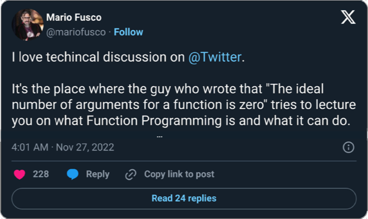

## Function Arguments

<div class="book-quote">
The ideal number of arguments for a function is zero (niladic). <br/>
Next comes one (monadic), followed closely by two (dyadic). <br/>
Three arguments (triadic) should be avoided where possible. <br/>
More than three (polyadic) requires very special justification—and then shouldn't be used anyway.
</div>

I think Robert Martin gets the most amount of hate for this one. 

<div style="text-align:center"><a target="_blank" href="https://x.com/mariofusco/status/1596791273431928832"></a></div>

The main problem with Martin's advice: it presents itself as "less is better" but handwaves all the downsides of the particular application.
He ignores trade-offs and side effects.

- "Smaller methods are better", but the increased amount of methods? Nah, you'll be fine.
- "Less arguments for a function is better", but the increased scope of mutable state? Nah, you'll be fine
- "Compression is better", but the bulging discs? Nah, you'll be fine.

One particularly odd suggestion is to "simplify" by moving arguments into instance state:

<div class="book-quote">
Arguments are hard. They take a lot of conceptual power. That's why I got rid of almost all of them from the example. 
Consider, for instance, the <code>StringBuffer</code> in the example. We could have passed it around as an argument rather than making it an instance variable, 
but then our readers would have had to interpret it each time they saw it. 
When you are reading the story told by the module, <code>includeSetupPage()</code> is easier to understand than <code>includeSetupPageInto(newPageContent)</code>
</div>

This doesn't eliminate complexity. It just moves it to another place. 
But worse: moving parameters to fields increases size and the scope of the mutable state of the application. This sacrifices global complexity to reduce local complexity.
Honestly, tracking shared mutable state in multi-threaded environments - is far harder than understanding function arguments. 

<div class="book-quote">
Arguments are even harder from a testing point of view. Imagine the difficulty of writing all the test cases to ensure that all the various combinations of arguments work properly. If there are no arguments, this is trivial.
</div>

Calling the methods became easier, but setting up the instance class and tracking the state becomes harder. This is not a winning move. 
It just moves complexity.

The discipline of functional programming exists precisely to limit mutable state, recognizing its significant cognitive overhead.
And while functional programming predates Clean Code, it's clear that by the time of Martin writing the book he wasn't really a fan.

<div class="book-quote">
One input argument is the next best thing to no arguments. SetupTeardownIncluder.render(pageData) is pretty easy to understand. 
Clearly we are going to render the data in the pageData object.
</div>

Beating the same dead horse: `render(pageData)` might be easy to understand. `SetupTeardownIncluder.render(pageData)` still doesn't make sense.

## Flag Arguments

<div class="book-quote">
"Flag arguments are ugly. Passing a boolean into a function is a truly terrible practice. It immediately complicates the signature of the method, 
loudly proclaiming that this function does more than one thing. It does one thing if the flag is true and another if the flag is false!"
</div>

Martin’s critique of flag arguments is front-loaded with emotion, but is it valid?
Adding boolean or any parameter is indeed a complication. Since `boolean` can accept 2 states, speaking more formaly adding boolean is doubling the domain space of the function.

Adding a boolean parameter to a function that already has 2 booleans will bring domain space from 4 to 8, this might be significant.
But adding boolean argument to a function that had none before would not kick complexity level into "unmanagable" territorry. It might be a tolerable increase. 

<div class="book-quote">
"Still, the method call render(true) is just plain confusing to a poor reader. Mousing over the call and seeing render(boolean isSuite) helps a little, but not that much. 
We should have split the function into two: renderForSuite() and renderForSingleTest()."
</div>

While `render(true)` is indeed unclear on a caller side, modern programming languages offer solutions, such as named parameters:

```python
render(asSuite = true)   # costs nothing in runtime
```

The larger problem with `render(true)` is so-called [boolean blindness](https://existentialtype.wordpress.com/2011/03/15/boolean-blindness/)

<div class="subtle-paragraph">
"The problem is computing the bit in the first place. Having done so, you have blinded yourself by reducing the information you have at hand to a bit, 
and then trying to recover that information later by remembering the provenance of that bit."

from [Boolean Blindness](https://existentialtype.wordpress.com/2011/03/15/boolean-blindness/)
</div>

The easiest solution to this code smell is to use disjoint unions (enums) where both options have with semantic meaning:

```java
enum ExcutionUnit { 
    SingleTest, 
    Suite 
} 

//...
public String renderAs(ExecutionUnit executionUnit) { ... }

// ------

//calling side:
renderAs(ExeuctionUnit.Suite);

```

It's unclear if Robert Martin [likes enums](./chapter_33.html).

The inherit unavoidable complexity is that tests can have 2 execution types: as a single test or as a part of a suite. 
Splitting the `render` function "into two: renderForSuite() and renderForSingleTest()" does not reduce it. (neither does using boolean or enum)
It is still 2 types of execution.
There will be place in code that would have to take a decision and select one of the branches.<br/> Please do not create Abstract Factory for every boolean in your code.

## Verbs and Keywords

<div class="book-quote">
"This last is an example of the keyword form of a function name. Using this form we encode the names of the arguments into the function name. 

For example, assertEquals might be better written as <pre><code>assertExpectedEqualsActual(expected, actual)</code></pre>
This strongly mitigates the problem of having to remember the ordering of the arguments."
</div>

The suggestion to encode order of parameters in the name is not scalable -
it works in isolation, but would degrate quickly with real API when you need to do all kind of assertions: 

- `assertExpectesIsGreaterOrEqualsThanActual`
- `assertActualContainsAllTheSameElementsAsExpected`

The best solution java can offer is fluent API: [AssertJ](https://github.com/assertj/assertj)

```java
assertThat(frodo.getName()).isEqualTo("Frodo");
```

Outside java, this problem has other solutions:

1. Named parameters - In languages like Python, named parameters eliminate ambiguity: 

```python
assertEquals(expected = something, actual = actual)
```

2. Macros - In Rust, macros like assert_eq! automatically capture and display argument details, making order irrelevant:

```rust
#[test]
fn test_string_eq() {
    let expected = String::from("hello");
    let actual = String::from("world");
    
    assert_eq!(expected, actual);
    // Error message:

    // thread 'test_string_eq' panicked at:
    // assertion `left == right` failed
    //   left: "hello"
    //  right: "world"
    //   at src/main.rs:17:5
}

```

