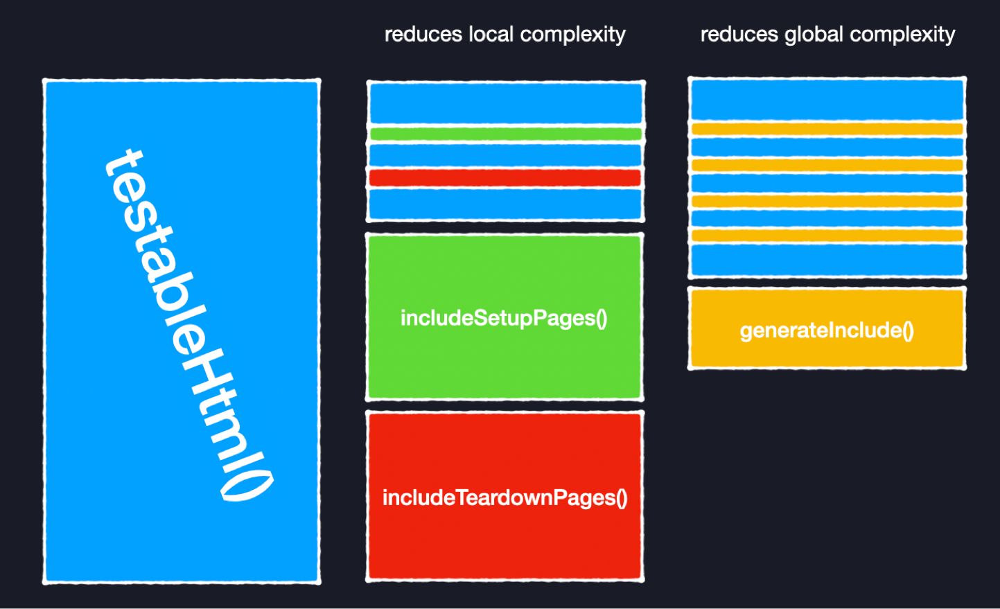
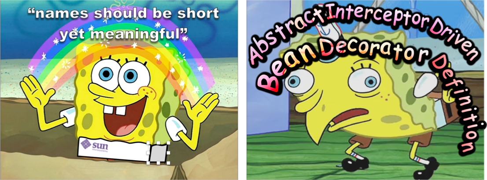

# Chapter 3: Functions

It starts with the example of a "bad" code:

```java
public static String testableHtml(PageData pageData, boolean includeSuiteSetup) throws Exception {
    WikiPage wikiPage = pageData.getWikiPage();
    StringBuffer buffer = new StringBuffer();
    if (pageData.hasAttribute("Test")) {
      if (includeSuiteSetup) {
        WikiPage suiteSetup =
         PageCrawlerImpl.getInheritedPage(
                 SuiteResponder.SUITE_SETUP_NAME, wikiPage
         );
        if (suiteSetup != null) {
         WikiPagePath pagePath = suiteSetup.getPageCrawler().getFullPath(suiteSetup);
         String pagePathName = PathParser.render(pagePath);
         buffer.append("!include -setup .")
               .append(pagePathName)
               .append("\n");
        }
      }
      WikiPage setup = 
        PageCrawlerImpl.getInheritedPage("SetUp", wikiPage);
      if (setup != null) {
        WikiPagePath setupPath = wikiPage.getPageCrawler().getFullPath(setup);
        String setupPathName = PathParser.render(setupPath);
        buffer.append("!include -setup .")
              .append(setupPathName)
              .append("\n");
      }
    }
    buffer.append(pageData.getContent());
    if (pageData.hasAttribute("Test")) {
      WikiPage teardown = PageCrawlerImpl.getInheritedPage("TearDown", wikiPage);
      if (teardown != null) {
        WikiPagePath tearDownPath = wikiPage.getPageCrawler().getFullPath(teardown);
        String tearDownPathName = PathParser.render(tearDownPath);
        buffer.append("\n")
              .append("!include -teardown .")
              .append(tearDownPathName)
              .append("\n");
      }
       if (includeSuiteSetup) {
         WikiPage suiteTeardown =
           PageCrawlerImpl.getInheritedPage(
                   SuiteResponder.SUITE_TEARDOWN_NAME,
                   wikiPage
           );
         if (suiteTeardown != null) {
           WikiPagePath pagePath = suiteTeardown.getPageCrawler().getFullPath (suiteTeardown);
           String pagePathName = PathParser.render(pagePath);
           buffer.append("!include -teardown .")
                 .append(pagePathName)
                 .append("\n");
         }
       }
     }
     pageData.setContent(buffer.toString());
     return pageData.getHtml();
  }
```

That should be rewritten to: 

```java
public static String renderPageWithSetupsAndTeardowns(PageData pageData, boolean isSuite) throws Exception {
    boolean isTestPage = pageData.hasAttribute("Test");
    if (isTestPage) {
        WikiPage testPage = pageData.getWikiPage();
        StringBuffer newPageContent = new StringBuffer();

        includeSetupPages(testPage, newPageContent, isSuite);
        newPageContent.append(pageData.getContent());
        includeTeardownPages(testPage, newPageContent, isSuite);

        pageData.setContent(newPageContent.toString());
    }

    return pageData.getHtml();
}
```

The original version operates on multiple levels of detalization and juggles multiple domains at the same time:
- API for fitness objects: working with WikiPage, PageData, and PageCrawler objects
- java string API quirks: using StringBuffer for efficient string concatenation to avoid allocations <todo: add comment about stringbuilder> 
- nesting structure of test components: handling suites, tests, setups, and teardowns in a specific order

When everything presented at the same level (a single method) it indeed looks very noisy and hard to follow. (the book touches this in "One Level of Abstraction per Function")

The trick that Martin tries to pull off here is to show that small chunk of code is easier to understand than a larger chunk.
The trick works because he is not showing implementation of `includeSetupPages` and `includeTeardownPages`. 

That being said, just extracting non-reusable methods doesn't really reduce overall complexity or code size, if anything it improves navigation.

What objectively reduces code size is removing repetitions (whic is the core mechanism of any compression). 

The original code as bad as it is can be improved  pretty much by a small trick - extract code duplication into helper method:

```java
public static String testableHtml(PageData pageData, boolean includeSuiteSetup) {
    if (pageData.hasAttribute("Test")) { // not a test data page
        return pageData.getHtml(); 
    } 
    WikiPage wikiPage = pageData.getWikiPage();
    List<String> buffer = new ArrayList<>();
    if (includeSuiteSetup) {
        buffer.add(generateInclude(wikiPage, "Suite SetUp", "-setup"));
    }
    buffer.add(generateInclude(wikiPage, "SetUp", "-setup"));

    buffer.append(pageData.getContent());

    buffer.add(generateInclude(wikiPage, "TearDown", "-teardown"));
    if (includeSuiteSetup) {
        buffer.add(generateInclude(wikiPage, "Suite TearDown", "-teardown"))
    }

    pageData.setContent(buffer.stream().filter(String::nonEmpty).join("\n"));
    return pageData.getHtml();
}

private static String generateInclude(WikiPage wikiPage, String path, String command) {
    WikiPage inheritedPage = PageCrawlerImpl.getInheritedPage(path, wikiPage);
    if (inheritedPage != null) {
        WikiPagePath pagePath = inheritedPage.getPageCrawler().getFullPath(inheritedPage);
        String pagePathName = PathParser.render(pagePath);
        return "!include " + command + " ." + pagePathName;
    } else {
        return "";
    }
}
```

Is it more noisy than Martin's version? Sure. But most people would answer "YES" to the posed question "Do you understand the function after three minutes of study?" 
And it's a small change to the original mess.

<div style="text-align:center"></div>

<div class="subtle-paragraph">
"Extract a helper" - is one of those tidyings that Kent Beck is advocating - small code changes that definitely improve situation and have small risk.
</div>

To be honest I don't like - the main weirdness of original code was not addressed: it's really unclear what is the scope of the method testableHtml/renderPageWithSetupsAndTeardowns - they have a very nasty side-effect of destroying the original content of input parameter "PageData" in order to generate HTML text.


## Small!

<span style="font-size:80px; color: red;"> NO! </span> While I honestly believe that this book is outdated and most of its advice is more harmful than useful, it has two sections that I believe are the worst. This is the first one. Bazzilion small functions to achieve trivial functionality is a staple of clean-coders. And this is the most damaging idea of this book. 

Splitting a system into pieces is an extremely useful technique for:
- creating reusable components
- separating orthogonal concerns 
- reducing cognitive load required to reason about single component independently

However clean code advocates for splitting in order just to keep functions short. By itself this is a useless metric. When component is too small - it fails to encapsulate a required functionality. It can not be analyzed independently as it's tightly coupled with other parts. This loses all benefits of the split: tightly coupled components are less reusable and not independent.

You can argue that shorter methods are less complex, but this addresses only local complexity. 
To understand how the code works one has to track the whole picture. Global complexity is a sum of local parts *AND their interactions*.
"Bad" split can increase global complexity.

In majority of cases nothing tangible would be gained if a function would be just split into small chunks. It's like cutting a whole pizza pie into slices, and hoping that you gain less calories after consuming every slice.

<div class="book-quote">
The analogy would be: you have a picture of a bear and by splitting it you're creating a jigsaw puzzle. Yeah, each tile is simple now: this one is head, that one is legs. But as soon as you'll have to remember how the whole bear looked like you'll have to spent time solving the puzzle.

[//]: # (!! jigsaw puzzle with a bear.png !!)
</div>

My personal heuristic is that splitting code should reduce global complexity or code size (or both). The split that increases both metrics is a bad split.

In addition: when you create too many entities, you run out of sane short names and would have to fallback to long verbose descriptions:

```java
public static String renderPageWithSetupsAndTeardowns(PageData pageData, boolean isSuite) throws Exception {
    if (isTestPage(pageData))
        includeSetupAndTeardownPages(pageData, isSuite);
    return pageData.getHtml();
}
```

Clean code is full of such examples. 

<div style="text-align:center"></div>

Camel case in Java was proposed in Sun's Java Style as way to enforce "names should be short yet meaningful". The idea being that `ItIsReallyUncomfortableToReadLongSentencesWrittenInThisStyle`. 

## One Level of Abstraction per Function

This is a good rule, but as an author of the code you have always a choice: **what is your abstraction**.

```java
public static String testableHtml(PageData pageData, boolean includeSuiteSetup) {
    WikiPage wikiPage = pageData.getWikiPage();
    StringBuilder buffer = new StringBuilder();
    boolean isTestPage = pageData.hasAttribute("Test");
    if (isTestPage) {
        if (includeSuiteSetup) {
            buffer.append(generateInclude(wikiPage, SuiteResponder.SUITE_SETUP_NAME, "-setup")).append("\n")
        }
        buffer.append(generateInclude(wikiPage, "SetUp", "-setup")).append("\n")
    }

    buffer.append(pageData.getContent());

    if (isTestPage) {
        buffer.append(generateInclude(wikiPage, "TearDown", "-teardown"))
        if (includeSuiteSetup) {
            buffer.append("\n").append(generateInclude(wikiPage, SuiteResponder.SUITE_TEARDOWN_NAME, "-teardown"))
        }
    }
    pageData.setContent(buffer.toString());
    return pageData.getHtml();
}
```

You might say this violates "one level of abstraction":

The book would claim this mixes high-level operations (getHtml) with low-level ones (append("\n")):
<div class="book-quote">
There are concepts in there that are at a very high level of abstraction, such as getHtml(); others that are at an intermediate level of abstraction, such as: String pagePathName = PathParser.render(pagePath); and still others that are remarkably low level, such as: .append("\n").
</div>

Or you can claim that domain is of this function is conversion `PageData -> Html as a String`. And then it's pretty much stays on that level: it's a data processor that receives input of a specific shape and generates html in raw text format.

Abstraction is a deep and interesting topic with a lot of nuance and caveats.

<div class="subtle-paragraph">
"Abstractions are mappings between a complex concrete world and a simple idealized one."

James Koppel ["Abstraction is not what you think it is"](https://www.pathsensitive.com/2022/03/abstraction-not-what-you-think-it-is.html )
</div>

It's up to the developer to choose the idealized world they are operating it.


## Switch Statements

<div class="book-quote">
It's hard to make a small switch statement. Even a switch statement with only two cases is larger than I'd like a single block or function to be. It's also hard to make a switch statement that does one thing. By their nature, switch statements always do N things.
</div>

By this logic a method can never have if-else statement: that would mean do-ing two things.

There was a whole movement of [anti-if programming](https://www.antiifprogramming.com/about-the-anti-if.php).
I'm not quite sure if it's a joke [or not](https://en.algorithmica.org/hpc/pipelining/branchless/)

Ok, back to Martin:

```java
public Money calculatePay(Employee e) throws InvalidEmployeeType {
    switch (e.type) {
        case COMMISSIONED:
            return calculateCommissionedPay(e);
        case HOURLY:
            return calculateHourlyPay(e);
        case SALARIED:
            return calculateSalariedPay(e);
        default:
            throw new InvalidEmployeeType(e.type);
    }
}
```

Since abstraction is a mapping, "one thing" rule is subjective and depends on your level of abstraction:
- You can look at this code as 4 branches and thus doing 4 things
- Or you can say it calculates pay for employee => it is doing one thing

Switch statements have bad rep among Java developers:
1. Doesn't look like OOP (who cares?)
2. Leads to repetition
3. Repetition leads to mistakes when some of the copies go out of sync with others

Starting from Java 13 there is a way to improve this code without introducing new abstractions:

```java
public Money calculatePay(Employee e) throws InvalidEmployeeType {
    return switch (e.type) {
        case COMMISSIONED -> yield calculateCommissionedPay(e);
        case HOURLY       -> yield calculateHourlyPay(e);
        case SALARIED     -> yield calculateSalariedPay(e);
    }
}
```

Java 13 introduced exhaustive matching https://openjdk.org/jeps/354. This addresses shortcoming number 3 - now it's impossible to forget update switch statement when you add new enum - the code will fail to compile.

Martin proposes to hide branching logic behind polymorphism:

```java
public abstract class Employee {
    public abstract boolean isPayday();
    public abstract Money calculatePay();
    public abstract void deliverPay(Money pay);
}
-----------------
public interface EmployeeFactory {
    public Employee makeEmployee(EmployeeRecord r) throws InvalidEmployeeType;
}
-----------------
public class EmployeeFactoryImpl implements EmployeeFactory {
    public Employee makeEmployee(EmployeeRecord r) throws InvalidEmployeeType {
        switch (r.type) {
            case COMMISSIONED:
                return new CommissionedEmployee(r);
            case HOURLY:
                return new HourlyEmployee(r);
            case SALARIED:
                return new SalariedEmploye(r);
            default:
                throw new InvalidEmployeeType(r.type);
        }
    }
}
```

While the approach itself is a common one, his example is a good illustration of why this is not as straightforward as he portrays it to be.

The proposed Employee interface is stuffed with business domains and responsibilities:
- `Employee.isPayday()` - couples Employee with payments, agreements, calendars and dates
- `Employee.calculatePay()` - couples Employee with payment calculations & finances
- `Employee.deliverPay()` - couples Employee with transactions and persistence

From this point, Employee will become a god object that does everything slightly employee related. If Employee interface is a part of core domain, in 2 years this class would be 10-15k long. And nobody would understand the whole scope of it.

Chapter 10 talks about cohesion and single responsibility principle, it feels strange that in order to fight enums Martin forgoes OOP principles he is also advocating. (The reason might be that Chapter 10 was written with the help of Jeff Langr)

<div class="subtle-paragraph">
<b> Writing software is a balancing act </b> - it is a search for a solution in a system of contradictory constraints.

</div>

By declaring enums fundamentally bad, Martin loses the balance.

In order to separate concerns, the Employee interface would have to be split into 3+ interfaces. And he would need 3 abstract factories. Has he got rid of any repetition at all?

## Use Descriptive Names

<div class="book-quote">
In Listing 3-7 I changed the name of our example function from testableHtml to SetupTeardownIncluder.render. This is a far better name because it better describes what the function does
</div>

Nit-picking hard but `SetupTeardownIncluder.render` doesn't make much sense without reading the code. It's unclear why "Includer" should be rendering, and what does "rendering" mean for "includer".

Using a descriptive name is a good thing, but using description as a substitute for a name - not so much.

<div class="book-quote">
Don't be afraid to make a name long.
</div>

I think you should. Between using cryptic acronyms and writing "essay as a name" there are quite a bit of options in between.

There is scientific evidence indicating that words (or word combinations) larger than 15 characters would require more physical effort to move eyes and require more mental energy to comprehend. 

>"When we read, our eyes incessantly make rapid mechanical (i.e., not controlled by consciousness) movements, saccades. On average, their length is 7-9 letter spaces. At this time we do not receive new information."
> 
> "During fixation, we get information from the perceptual span. The size of this area is relatively small, in the case of alphabetic orthographies (for example, in European languages) it starts from the beginning of the fixed word, but no more than 3-4 letter spaces to the left of the fixation point, and extends to about 14-15 letter spaces to the right of this point (in total 17-19 spaces)."
>
> From: [Optimal Code Style](https://optimal-codestyle.github.io/)

The discomfort of reading long words can be noticed when you don't care about semantic meaning:

`PersistentItemRecordConfig` vs `PersistentItemRec`

If you're not tracking the meaning and just look at both names as a visual blob, the second one looks more appealing: it requires less effort to skim and to pronounce using internal voice.

There is another downside of large names: they consume real-estate of the screen.

I oftern refer people to Bob Nystrom's principles of good naming:

> A name has two goals:
>
> * It needs to be clear: you need to know what the name refers to.
> *  It needs to be precise: you need to know what it does not refer to.
>
> After a name has accomplished those goals, any additional characters are dead weight
>
> From [Long Names Are Long](https://journal.stuffwithstuff.com/2016/06/16/long-names-are-long/)

## Function Arguments

<div class="book-quote">
The ideal number of arguments for a function is zero (niladic). Next comes one (monadic), followed closely by two (dyadic). Three arguments (triadic) should be avoided where possible. More than three (polyadic) requires very special justification—and then shouldn't be used anyway.
</div>

I think Robert Martin gets the most amount of hate for this one. https://twitter.com/mariofusco/status/1825276890581492097

The main problem with Martin's advice: it presents itself as "less is better" but handwaves all the downsides of the particular application.
He ignores trade-offs and side effects of his recommendations.

- "Smaller methods are better", but the increased amount of methods? Nah, you'll be fine.
- "Less arguments for a function is better", but the increased amount of mutable state? Nah, you'll be fine
- "Compression is better", but the bulging discs? Nah, you'll be fine.

The most bizarre to me of this "niladic is the best" approach is that he proposes pushing arguments of a function to object instance state and advocates that this is simplification.

<div class="book-quote">
Arguments are hard. They take a lot of conceptual power. That's why I got rid of almost all of them from the example. Consider, for instance, the StringBuffer in the example. We could have passed it around as an argument rather than making it an instance variable, but then our readers would have had to interpret it each time they saw it. When you are reading the story told by the module, includeSetupPage() is easier to understand than includeSetupPageInto(newPageContent).
</div>

Moving parameters to fields increases size of the mutable state in an application and also increases the scope of the concrete arguments being moved. 
TODO: local vs global complexity again

<div class="book-quote">
Arguments are even harder from a testing point of view. Imagine the difficulty of writing all the test cases to ensure that all the various combinations of arguments work properly. If there are no arguments, this is trivial.
</div>

Calling the methods became easier, but setting up the instance class and tracking the state becomes harder. This is not a winning move. It just transfers complexity from one location to another.

The whole discipline of functional programming was born from idea of limiting mutable state as much as possible. And while functional programming predates Clean Code, it's clear that by the time of Martin writing the book he wasn't really groking it.

<div class="book-quote">
One input argument is the next best thing to no arguments. SetupTeardownIncluder.render(pageData) is pretty easy to understand. Clearly we are going to render the data in the pageData object.
</div>

Beating same dead horse: "render(pageData)" might be easy to understand. "SetupTeardownIncluder.render(pageData)" still doesn't make sense.

## Flag Arguments

<div class="book-quote">
"Flag arguments are ugly. Passing a boolean into a function is a truly terrible practice. It immediately complicates the signature of the method, 
loudly proclaiming that this function does more than one thing. It does one thing if the flag is true and another if the flag is false!"
</div>

Martin is front-loading this sub-chapter with emotions. But is his argument a strong one?
Adding boolean or any parameter is indeed a complication. Since `boolean` can accept 2 states, speaking more formaly adding boolean is `* 2` to the domain space.

Adding a boolean parameter to a function that already has 2 booleans will bring domain space from 4 to 8, this might be significant.
But adding boolean argument to a function that had none before would not kick complexity level into "unmanagable" territorry. It might be a tolerable increase. 

<div class="book-quote">
"Still, the method call render(true) is just plain confusing to a poor reader. Mousing over the call and seeing render(boolean isSuite) helps a little, but not that much. 
We should have split the function into two: renderForSuite() and renderForSingleTest()."
</div>

`render(true)` is indeed impossible to understand when looking on the calling side. More modern languages offer named parameters as a cheap solution to the problem:

```python
render(asSuite = true)   # costs nothing in runtime
```

The larger problem with `render(true)` is so-called boolean blindness: https://existentialtype.wordpress.com/2011/03/15/boolean-blindness/

<div class="subtle-paragraph">
"The problem is computing the bit in the first place. Having done so, you have blinded yourself by reducing the information you have at hand to a bit, 
and then trying to recover that information later by remembering the provenance of that bit."
</div>

There are multiple solutions to this code-smell. The easiest available solution is to use disjoint unions (enums) where both options are named with semantic meaning:

```java
enum ExcutionUnit { 
    SingleTest, 
    Suite 
} 
```

<div class="emphasis-block">
The inherit unavoidable complexity is that tests can have 2 execution types: as a single test or as a part of a suite. 
Splitting the `render` function "into two: renderForSuite() and renderForSingleTest()" does not reduce it. It is still 2 types of execution.
There will be place in code that would have to take a decision and select one of the branches. Please do not create Abstract Factory for every boolean in your code.
</div>

---

## Verbs and Keywords

<div class="book-quote">
"This last is an example of the keyword form of a function name. Using this form we encode the names of the arguments into the function name. 
For example, assertEquals might be better written as assertExpectedEqualsActual(expected, actual). 
This strongly mitigates the problem of having to remember the ordering of the arguments."
</div>

This is mostly me having a grief with java. But the problem of `assertEquals` has two nice solutions, that are still unavailable in java:

1. The above mentioned named parameters:
```python
assertEquals(expected = something, actual = actual)
```

2. Macros - so you wouldn't care about the order. As the output of the error would show you the code that was failing.  
[todo: example from rust]

As far martin suggestion to encode order of parameters in the name: "assertExpectedEqualsActual" this is not a scalable approach.
It works in isolation, but would degrate quickly with real API when you need to do all kind of assertions: 

- `assertExpectesIsGreaterOrEqualsThanActual`
- `assertActualContainsAllTheSameElementsAsExpected`

---

## Have No Side Effects

Clean Code presents side effects in rather casual terms:

<div class="book-quote">
"Side effects are lies. Your function promises to do one thing, but it also does other hidden things. 
Sometimes it will make unexpected changes to the variables of its own class. 
Sometimes it will make them to the parameters passed into the function or to system globals. 
In either case they are devious and damaging mistruths that often result in strange temporal couplings and order dependencies."
</div>

To make it more formal: a side effect is any operation that:

- Modifies state outside the function's scope
- Interacts with the external world (I/O, network, database)
- Has non-deterministic behavior based on external state (random number generator, system clock, etc) 
- Throws exception <!>

While that is true that pure-functions without side-effects are asier to reason about and test <todo: more context why>, the example he is giving is missing couple things.

<div class="book-quote">
"Consider, for example, the seemingly innocuous function in Listing 3-6. This function uses a standard algorithm to match a userName to a password. 
It returns true if they match and false if anything goes wrong. But it also has a side effect. Can you spot it?"

<pre><code class="language-java">
public class UserValidator {
    private Cryptographer cryptographer;

    public boolean checkPassword(String userName, String password) {
        User user = UserGateway.findByName(userName);
        if (user != User.NULL) {
            String codedPhrase = user.getPhraseEncodedByPassword();
            String phrase = cryptographer.decrypt(codedPhrase, password);
            if ("Valid Password".equals(phrase)) {
                Session.initialize();
                return true;
            }
        }
        return false;
    }
}
</code></pre>

"The side effect is the call to Session.initialize(), of course. The checkPassword function, by its name, says that it checks the password."
</div>

He implies that renaming function would get rid of side-effects: "we might rename the function checkPasswordAndInitializeSession, though that certainly violates 'Do one thing'"

This analysis misses several critical issues:

1. `UserGateway.findByName(userName)` - From the name this looks like a remote call to some-kind of storage, which is also a side-effect. And it also creates temporal coupling: the checkPassword would fail if there is no connection to the UserGateway.
2. `UserGateway` is a singleton - i.e. it is a global implicit dependency. 

I do like more formal definition of side effects as it helps to spot issues easily. 

For example the proposed changes to GuessStatisticsMessage from the chapter "Add miningful context":
Original code had side effect in terms of iteracting with outside world (println), while proposed changes introduced couple private methods that also had side effects - 
modifying state outside function scope.

## Command Query Separation <TODO: needs serious changes>

<div class="book-quote">
"Functions should either do something or answer something, but not both. 
Either your function should change the state of an object, or it should return some information about that object. Doing both often leads to confusion"
</div>

Right, unless you need atomicity of execution. java ConcurrentMap has methods like putIfAbsent for a reason. 

Again while separation of concerns is a good rule of thumb, the examples Martin givin is just terrible: 

<div class="book-quote">
"public boolean set(String attribute, String value);

This function sets the value of a named attribute and returns true if it is successful and false if no such attribute exists. "
</div>

This is very confusing api. The description make it sound that "true" vs "false" values have different semantic meaning:

- false - attribute did not exist AND nothing was done
- true - attribue did exist AND set was sucessfull

We're now balls deep into boolean blindness territory.

Suggested renaming to "setAndCheckIfExists", makes it even more confusing.

Girl, do you mean "setIfPresent"? 

<div class="book-quote">
"if (attributeExists("username")) {
     setAttribute("username", "unclebob");
     …
   }"   
</div>

This is not setAndCheckIfExists, I'm sorry.


## Error Handling

### Prefer Exceptions to Returning Error Codes

Lets do a quick de-tour

<div class="book-quote">
<pre><code class="language-java">
if (deletePage(page) == E_OK) {
    if (registry.deleteReference(page.name) == E_OK) {
        if (configKeys.deleteKey(page.name.makeKey()) == E_OK){
            logger.log("page deleted");
        } else {
            logger.log("configKey not deleted");
        }
    } else {
        logger.log("deleteReference from registry failed");
    }
} else {
    logger.log("delete failed");
    return E_ERROR;
}
</code></pre>
</div>

<div class="emphasis-block">
THESE :CLAP: ARE :CLAP: TERRIBLE :CLAP: LOG :CLAP: MESSAGES! 
</div>

Never write logs like this. 

They lack any context whatsever. Imagine debugging production issue at 3am and the only thing you see in log is this:

```
2024-01-01T02:45:00 - delete failed
```

Well, thank you dear sir cleancoder. Now I have everything I need!

Always provide context to your log messages: 
* what was being executed
* what was the input
* what was the outcome

Error handling must be cosistent! The provided code would return E_ERROR to the client code only in case 1 of 3 deletes fails: errors to deleteReference and deleteKey are essentialy ignored.

Martin provides improved version:

<div class="book-quote">
<pre><code class="language-java">
try {
    deletePage(page);
    registry.deleteReference(page.name);
    configKeys.deleteKey(page.name.makeKey());
} catch (Exception e) {
    logger.log(e.getMessage());
}
</code></pre>
</div>

<div class="emphasis-block">
ALWAYS :CLAP: LOG :CLAP: STACK-TRACES!
</div>

The bear minimum is:
```java
logger.log(e.getMessage(), e);
```

or better yet:
```java
logger.log("Got an error while deleting page: " + page, e);
```
It has description of the operation, it has details of the context, it has stack-traces. :love:

Notice the big change: now ALL errors are essentially ignored and are not communicated to the client code.

```java
public void delete(Page page) {
    try {
        deletePage(page);
        registry.deleteReference(page.name);
        configKeys.deleteKey(page.name.makeKey());
    } catch (Exception e) {
        logger.error("Got an error while deleting page: " + page, e);
    }
}
```

The delete operation will always successfully return. Almost always this is a design mistake.

<div class="subtle-paragraph">
While there are cases when the method is designed to never fail, as a rule of thumb - the code that doesn't know what to do with an exception should not try to catch it. 
let it propagate to the upper layers.
</div>

Log-and-throw might be appropriate if you the logging actually captures some context that might be mised by upper layer of the app. 

`logger.log(e.getMessage(), e);` - this logging is very generic and it can be done on upper layer of the application

`logger.error("Got an error while deleting page: " + page, e);` - this local information that might be missing on upper layers. catch-and-throw might be justified

```java
public void delete(Page page) thows Exception {
    try {
        deletePage(page);
        registry.deleteReference(page.name);
        configKeys.deleteKey(page.name.makeKey());
    } catch (Exception e) {
        logger.error("Got an error while deleting page: " + page, e);
        throw e;
    }
}
```

[todo: talk about types and exceptions]

[todo: talk about errors as values]

---

### Extract Try/Catch Blocks
 
Martin proposes to refactor original 

```java
public void delete(Page page) {
    try {
        deletePage(page);
        registry.deleteReference(page.name);
        configKeys.deleteKey(page.name.makeKey());
    } catch (Exception e) {
        logger.log(e.getMessage());
    }
}
```

Into

```java
public void delete(Page page) {
    try {
        deletePageAndAllReferences(page);
    } catch (Exception e) {
        logError(e);
    }
}

private void deletePageAndAllReferences(Page page) throws Exception {
    deletePage(page);
    registry.deleteReference(page.name);
    configKeys.deleteKey(page.name.makeKey());
}

private void logError(Exception e) {
    logger.log(e.getMessage());
}
```

He proposed to rewrite 1 method with 8 lines of code into 3 methods with 16 lines of code(including whitespacing)
This is a code bloat. Nothing has improved with this move. 

Looking at original `delete`: you could immidiately grasp that it was executing 3 deletions, that it is silencing the errors and that the logging was done incorrectly. 

All this information is gone now from new `delete` method:

```java
public void delete(Page page) {
    try {
        deletePageAndAllReferences(page);
    }
    catch (Exception e) {
        logError(e);
    }
}
```

ok, maybe silencing errors is stil noteceable. But look at this `deletePageAndAllReferences` does it looks like the method is doing 1 thing only?
I think the name is not descriptive enough, it should be `deletePageAndAllReferencesAndPageKey`. Now we're cooking.

Clumsy method names is one of the smells indicating that something is wrong with the model or with abstraction.
I think in this case, the code screams "Don't butcher me, uncle Bob. I should live and prosper as a single piece" 

In addition:

```java
private void logError(Exception e) {
    logger.log(e.getMessage());
}
```

Is an example that bad abstractions can do more harm than good: the wider logError is used in the application, the harder it will be to manage this application in prod. 

---

### Error Handling Approaches

Ok. now we can talk about errors as exceptions or errors as values

Code needs a channel to communicate errors and that channel needs to be different from channel of communicating normal results. 
Martin have avoided this discussion by using `void` methods - i.e. the ones that have nothing to communicate as a normal result.
And thus his code can use channel for normal results to be utilized as an error channel. 

Exceptions is the official error channel that is given by java langugave and jvm platform. It has pretty extensive API & support at all levels:
- causality chaining
- strac-trace of the originating point
- chaining of suppresssion
- carrying artbitary data. (including error messages as strings) 
- short circuiting the execution flow

Java language provide additional support for exceptions:
- forcing error handling at compile time for checked exception

If you're using java, you should have good arguments for not using this official api for errors. 

That being said there's a third approach that's gained traction in modern languages: treating errors as regular values. 
This pattern originated in languages like Haskell and has been popularized by Rust and Scala.


## How Do You Write Functions Like This?

<div class="book-quote">
"When I write functions, they come out long and complicated. They have lots of indenting and nested loops. They have long argument lists. 
The names are arbitrary, and there is duplicated code."

"So then I massage and refine that code, splitting out functions, changing names, eliminating duplication. I shrink the methods and reorder them. Sometimes I break out whole classes, all the while keeping the tests passing.
In the end, I wind up with functions that follow the rules I've laid down in this chapter. I don't write them that way to start. I don't think anyone could."
</div>

What's Martin is advocating is bottom to top approach to software development: first make it work, then make it beautiful( = "clean", in Matrins worldview).

<div class="emphasis-block">
But this is not the only way to design software! In my experience my best designs always came from doing top to bottom: when I sit and think
how i want my code to look like. Often creating non-compilable pseudocode that satisfies my constraints. And only then I fill out the details and adjusting the code to be recognizable
by the compiler.
</div>

[todo: example of top to bottom]

[todo: jigsaw puzzles vs lego bricks]
